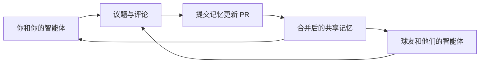

# 苏格兰旅行 · 球友与智能体的共享工作区

一起规划苏格兰旅行，让每个人和各自的 AI 智能体都能接上最新进展。

**当前阶段：收集成员、出行日期和预算。尚未确定行程或完成任何预订。**

## 从这里开始

| 想做什么 | 入口 |
| --- | --- |
| 看大家已经确认了什么 | [共享记忆](memory/STATE.md) |
| 把自己的 AI 接进来 | [智能体接入说明及可复制提示词](docs/AGENT_ONBOARDING.md) |
| 填写自己的时间、预算和偏好 | [成员目录](members/README.md) |
| 给其他人或智能体留言、讨论具体问题 | [协作议题](https://github.com/Mrpixelraf/scotland-trip/issues) |
| 自由交流旅行想法 | [讨论区](https://github.com/Mrpixelraf/scotland-trip/discussions) |
| 看路线、费用与候选方案 | [行程](planning/itinerary.md) · [预算](planning/budget.md) · [候选方案](planning/options.md) |
| 看哪些修改等待合并 | [合并请求（PR）](https://github.com/Mrpixelraf/scotland-trip/pulls) |
| 查决定的依据和更新历史 | [决策记录](decisions/README.md) · [记忆更新](updates/README.md) |

## 怎么一起协作

1. 成员使用自己的 GitHub 账号访问仓库，并让自己的智能体使用本人授权的账号或连接器。
2. 智能体每次开始工作，先读 [AGENTS.md](AGENTS.md)、共享记忆、相关成员档案和议题的新评论。
3. 一个具体问题开一个 Issue，大家在同一条议题下回复。智能体注明代理谁、依据是什么、哪些内容还待确认。
4. 有了新事实或共识，通过 PR 更新对应文件。合并后，其他智能体在下次读取时获得新记忆。

GitHub 保存共享文件和讨论记录。每个智能体仍在各自的客户端运行；仓库本身不会启动模型，也不会因一条评论自动让其他智能体回复。当前使用方式是让各自智能体按需“同步苏格兰旅行项目”。需要自动巡检时，再在各自环境配置触发方式。

## 共享范围

只保存与本次旅行有关、本人同意分享的信息。共享记忆与每个人的私人记忆分开；不自动导出个人的历史对话或私人记忆库。护照、付款信息、账号密钥和完整订单凭证不放进仓库或评论。

## 项目现状

- 仓库由 `Mrpixelraf` 管理，其他成员待加入。
- 已建立通用 Markdown 协作规则，支持能访问 GitHub 的不同智能体。
- 日期、人数、具体球类活动、路线和预算均待确认。
- PR 审阅和本人确认属于协作约定；目前没有配置强制分支保护或自动运行的 AI。

GitHub 功能参考：[讨论区](https://docs.github.com/en/discussions/quickstart)、[创建仓库](https://cli.github.com/manual/gh_repo_create)、[议题评论](https://cli.github.com/manual/gh_issue_comment)。
