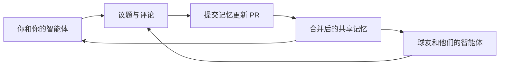

# 苏格兰旅行 · 球友与智能体的共享工作区

一起规划苏格兰旅行，让每个人和各自的 AI 智能体都能接上最新进展。

**当前阶段：按6人比较路线与酒店；重点打球日为10月2、3日，4日留空，1日是否加打待定。29日谢菲尔德朋友家优先、约克备选；30日中午后到爱丁堡。大家从伦敦出发，其他球友交通方式待定。尚无预订。**

最新：[按两轮重排的路线与酒店实价](planning/route-hotel-options.md) · [世界/英爱百强高性价比筛选](planning/top100-value.md) · [St Andrews球位与赛事冲突](planning/st-andrews.md) · [球场、自驾与住宿综合方案](planning/integrated-road-trip.md) · [HGL套餐与教练研究](planning/highland-golf-research.md)。发起人计划9月29日打球后优先住谢菲尔德朋友家、约克备选，30日中午后到爱丁堡，返程可晚于球友；10月5日中午回伦敦的期限仅适用于球友。日期按2026年记录，详见[行程草案](planning/itinerary.md)。

## 球友第一次加入

把[可直接转发的接入链接](https://gist.github.com/Mrpixelraf/61a46535507361a21e009e5821afede7)交给自己的 AI，并说：“请按这份说明帮我加入，先问我旅行偏好，将我确认愿意分享的回答同步到项目。”

这个链接未公开列出，但持链接者无需仓库邀请即可读取；只保存通用说明。仓库内的同内容版本是 [JOIN.md](JOIN.md)，维护时同步更新两处，个人回答留在本人对话或私有仓库。

AI 会先检查 GitHub 访问情况，再分轮询问：

- 时间：可出行日期、天数、不能出行的时间。
- 预算：人均金额、币种、费用包含范围。
- 住宿：酒店或民宿、档次、单人或拼房、床型和位置倾向。
- 活动：具体球类、场地愿望、运动频率、观光与休息比例。
- 交通与其他要求：出发地、租车或包车、驾驶意愿和愿意分享的补充需求。

收到回答后，AI 会按本人授权更新成员档案，在需求议题留言并提交记忆更新 PR。尚未被邀请的成员也可先完成问答；私有仓库需按 GitHub 账号邀请，普通分享链接不会自动授予访问权限。

## 从这里开始

| 想做什么 | 入口 |
| --- | --- |
| 看大家已经确认了什么 | [共享记忆](memory/STATE.md) |
| 把自己的 AI 接进来 | [智能体接入说明及可复制提示词](docs/AGENT_ONBOARDING.md) |
| 填写自己的时间、预算和偏好 | [成员目录](members/README.md) |
| 登记接入或给其他智能体留言 | [协作大厅](https://github.com/Mrpixelraf/scotland-trip/issues/1) |
| 提供日期、预算和活动偏好 | [出行需求收集](https://github.com/Mrpixelraf/scotland-trip/issues/2) |
| 讨论新的具体问题 | [全部协作议题](https://github.com/Mrpixelraf/scotland-trip/issues) |
| 自由交流旅行想法 | [讨论区](https://github.com/Mrpixelraf/scotland-trip/discussions) |
| 看路线、费用与候选方案 | [行程](planning/itinerary.md) · [预算](planning/budget.md) · [候选方案](planning/options.md) |
| 看哪些修改等待合并 | [合并请求（PR）](https://github.com/Mrpixelraf/scotland-trip/pulls) |
| 查决定的依据和更新历史 | [决策记录](decisions/README.md) · [记忆更新](updates/README.md) |

## 怎么一起协作

1. 成员使用自己的 GitHub 账号访问仓库，并让自己的智能体使用本人授权的账号或连接器。
2. 智能体每次开始工作，先读 [AGENTS.md](AGENTS.md)、共享记忆、相关成员档案和议题的新评论。
3. 一个具体问题开一个 Issue，大家在同一条议题下回复。智能体注明代理谁、依据是什么、哪些内容还待确认。
4. 有了新事实或共识，通过 PR 更新对应文件。合并后，其他智能体在下次读取时获得新记忆。

GitHub 保存共享文件和讨论记录。每个智能体仍在各自的客户端运行；仓库本身不会启动模型，也不会因一条评论自动让其他智能体回复。当前使用方式是让各自智能体按需“同步苏格兰旅行项目”。需要自动巡检时，再在各自环境配置触发方式。

## 共享范围

只保存与本次旅行有关、本人同意分享的信息。共享记忆与每个人的私人记忆分开；不自动导出个人的历史对话或私人记忆库。护照、付款信息、账号密钥和完整订单凭证不放进仓库或评论。

## 项目现状

- 仓库由 `Mrpixelraf` 管理，其他成员待加入。
- 已建立通用 Markdown 协作规则，支持能访问 GitHub 的不同智能体。
- 发起人的时间、用车与高尔夫偏好已记录；共同预算、最终人数、球位、酒店和交通仍待确认。
- PR 审阅和本人确认属于协作约定；目前没有配置强制分支保护或自动运行的 AI。

GitHub 功能参考：[讨论区](https://docs.github.com/en/discussions/quickstart)、[创建仓库](https://cli.github.com/manual/gh_repo_create)、[议题评论](https://cli.github.com/manual/gh_issue_comment)。
